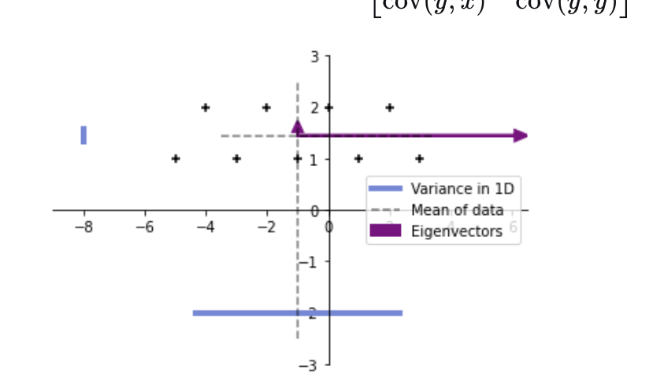
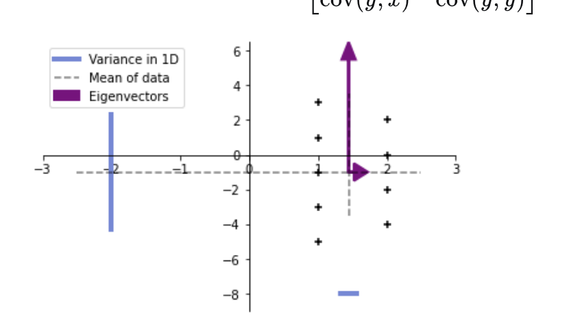

# Symmetric, positive definite matrices

What does it mean when we say that a matrix is symmetric and positive definite?

A matrix $M$ is symmetric if $M = M^T$.

A symmetric matrix $M$ is positive-definite if $z^T M z > 0$ for a real column vector $z \neq 0$, or in matrix form:

$$\begin{bmatrix}z_1 & z_2 & \cdots & z_n \end{bmatrix}\begin{bmatrix}M_{11} & M_{12} & \cdots & M_{1n} \\ M_{21} & M_{22} & \ddots & \vdots\\ \vdots & \ddots & \ddots & \vdots \\ M_{n1} & \cdots & \cdots & M_{nn} \end{bmatrix}\begin{bmatrix}z_1 \\ z_2 \\ \vdots \\ z_n \end{bmatrix} > 0$$

An example of symmetric and positive definite matrix is $\begin{bmatrix} 7 & 1 \\ 1 & 2\end{bmatrix}$.

The eigenvalues of symmetric positive matrices are positive. To see this, consider a symmetric positive-definite matrix $M$. Let $\lambda$ denote an eigenvalue of $M$, then we have $Mv = \lambda v$ where $v$ is the corresponding eigenvector. When $M$ is positive-definite, we have $v^T M v = \lambda v^T v > 0$. Since $v^T v \geq 0$, it follows that the $\lambda$ must be positive.

The covariance matrix is symmetric and positive-definite.

It is easy to show that it is symmetric.

It is also positive-definite. To see this, let's take a step back and look at the covariance matrix for a dataset of two independent random variables $x$ and $y$. We have created a few visualizations for a 2-dimensional dataset with the different covariance matrices. In the figure, the cross represents the individual examples in the dataset. The gray dashed lines represent the sample mean of the dataset in each dimension. The blue lines show the sample variance in each dimension. Finally, the purple arrows show the eigenvectors for the covariance matrix in each dimension.

In the first example, we show a dataset with the covariance matrix:

$$\begin{bmatrix} \operatorname{cov}(x,x) & \operatorname{cov}(x,y) \\ \operatorname{cov}(y,x) & \operatorname{cov}(y,y) \end{bmatrix} = \begin{bmatrix} 7.5 & 0 \\ 0 & 1.1\end{bmatrix}$$



In the second example, we use the following covariance matrix:

$$\begin{bmatrix} \operatorname{cov}(x,x) & \operatorname{cov}(x,y) \\ \operatorname{cov}(y,x) & \operatorname{cov}(y,y) \end{bmatrix} = \begin{bmatrix} 1.11 & 0 \\ 0 & 7.5\end{bmatrix}$$



In both cases the covariance matrix the two variables are independent since $\operatorname{cov}(x,y) = \operatorname{cov}(y,x) = 0$. As a result, the covariance matrices are diagonal. The diagonal entries are the variances for each of the variables, and are always positive. Notice that the eigenvalues of the matrix are equal to the variances.

The eigenvectors are orthogonal to one another (because of the symmetry of the matrix, see this derivation for more information) and represent the different directions in which the data varies. The direction in which the variables vary the most coincide with the eigenvectors.

For the two examples of datasets with independent variables, the eigenvectors are along the x and y axes. What happens when $\operatorname{cov}(x,y) \neq 0$?

Run this code block, and feel free to add/remove points:

```python
fig, ax = plt.subplots()

# The dataset to be plotted. You can add and remove points 
# from the array to create a dataset with cov(x, y) != 0
data = np.array([[1,1],
                [-3,-3],
                [2,2],
                [0,2],
                [-2,0],
                [1,3],
```

The matrix of eigenvalues $D$ can be obtained by diagonalisation as covered in Mathematics for Machine Learning: Linear Algebra: $D = C^{-1} M C$ where $C$ is the matrix of eigenvectors. This is how the covariance matrix will always be similar to a diagonal matrix with positive, real entries - the variances along the eigenvectors.

You can have a brief look at the [Wikipedia article on positive definite matrices](https://en.wikipedia.org/wiki/Positive-definite_matrix) for further information outside of the scope of the course.
