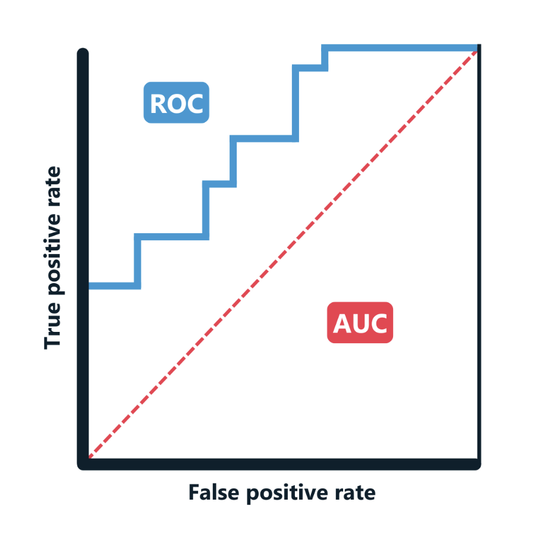

# Detailed explanation of evaluation metrics

## Introduction

When evaluating a fine-tuned model, it is essential to use appropriate metrics to understand its performance. Different metrics can provide insights into various aspects of model behavior, such as its ability to classify correctly, its sensitivity to certain classes, and how well it generalizes to new data. In this reading, we will take a detailed look at the most commonly used evaluation metrics: accuracy, precision, recall, F1 score, and others such as the confusion matrix, receiver operating characteristic–area under the curve (ROC-AUC), loss, and specificity.

By the end of this reading, you will be able to:

- Explain the importance of evaluating fine-tuned models using different metrics.
- Identify when to use various metrics, such as accuracy, precision, recall, and F1 score, based on the specific goals of the task.
- Interpret confusion matrices and ROC-AUC curves to visualize model performance.
- Explain loss and specificity metrics and how they relate to model learning.
- Select the most appropriate evaluation metrics for balanced, imbalanced, or cost-sensitive tasks.

## Evaluation metrics explained

Explore the following evaluation metrics:

- Evaluation Metric 1: Accuracy
- Evaluation Metric 2: Precision
- Evaluation Metric 3: Recall (sensitivity or true positive rate)
- Evaluation Metric 4: F1 score
- Evaluation Metric 5: Confusion matrix
- Evaluation Metric 6: Specificity (true negative rate)
- Evaluation Metric 7: ROC-AUC
- Evaluation Metric 8: Loss

### Evaluation Metric 1: Accuracy

#### Definition
Accuracy measures the proportion of correctly classified instances out of the total number of instances. It is the most straightforward metric for classification tasks.

#### Formula

$$\text{Accuracy} = \frac{TP + TN}{TP + TN + FP + FN}$$

Where:
- TP (true positives): correct positive predictions
- TN (true negatives): correct negative predictions
- FP (false positives): incorrect positive predictions
- FN (false negatives): incorrect negative predictions

#### When to use
Accuracy is a good metric when the class distribution is balanced. However, in the case of imbalanced datasets (in which one class occurs far more frequently than another), accuracy can be misleading. For example, in a dataset in which 90 percent of instances are of class A and only 10 percent are of class B, a model that always predicts class A would achieve 90 percent accuracy, but it would perform poorly for class B.

### Evaluation Metric 2: Precision

#### Definition
Precision measures how many of the model's positive predictions are actually correct. It is useful when false positives are particularly costly (e.g., in spam or fraud detection).

#### Formula
#### Formula

$$\text{Precision} = \frac{TP}{TP + FP}$$

Where:
- TP (true positives): correct positive predictions
- FP (false positives): incorrect positive predictions

#### When to use
Precision is important when the cost of a false positive is high, meaning it's better to be cautious when predicting positives. A high precision means fewer false positives, but it doesn't account for false negatives.

### Evaluation Metric 3: Recall (sensitivity or true positive rate)

#### Definition
Recall measures how many of the actual positives in the dataset the model correctly identifies. It is essential in scenarios where missing positives (false negatives) can have serious consequences (e.g., in medical diagnosis or fraud detection).

#### Formula
$$\text{Recall} = \frac{TP}{TP + FN}$$

Where:
- TP (true positives): correct positive predictions
- FN (false negatives): incorrect negative predictions

#### When to use
Recall is crucial when the goal is to capture as many positive instances as possible, even if that means allowing some false positives. For example, in a cancer detection model, it's more important to catch as many true cases of cancer as possible, even if some false positives are included.

### Evaluation Metric 4: F1 score

#### Definition
The F1 score is the harmonic mean of precision and recall, providing a single metric that balances both. It's useful when you want to find a middle ground between precision and recall, particularly in cases of imbalanced datasets.

#### Formula
$$\text{F1 Score} = \frac{2 \times \text{Precision} \times \text{Recall}}{\text{Precision} + \text{Recall}}$$

Where:
- Precision: the proportion of positive identifications that were actually correct
- Recall: the proportion of actual positives that were correctly identified

#### When to use
The F1 score is most helpful when both precision and recall are important, and there is a need to balance the two. For example, in a fraud detection system, we want to minimize both false positives (to avoid unnecessary investigations) and false negatives (to catch as much fraud as possible).

### Evaluation Metric 5: Confusion matrix

#### Definition
A confusion matrix is a table that allows you to visualize the performance of a classification model by comparing actual versus predicted values. It provides a detailed breakdown of true positives (TP), true negatives (TN), false positives (FP), and false negatives (FN).

#### Example

| | Predicted positive | Predicted negative |
|--------------|-----------------|-----------------|
| **Actual positive** | True positive | False negative |
| **Actual negative** | False positive | True negative |

#### When to use
A confusion matrix is especially useful when analyzing a model's errors. For example, in a binary classification problem, you can easily see whether the model is making more false positives or false negatives, helping you to adjust the model accordingly.

### Evaluation Metric 6: Specificity (true negative rate)

#### Definition
Specificity measures the proportion of actual negatives that the model correctly identifies. It is the opposite of recall, as it focuses on how well the model avoids false positives.

#### Formula
$$\text{Specificity} = \frac{TN}{TN + FP}$$

Where:
- TN (true negatives): correct negative predictions
- FP (false positives): incorrect positive predictions

#### When to use
Specificity is useful when the cost of false positives is high. For example, in certain medical tests, it's important to minimize the number of false positives to avoid unnecessary treatments.

### Evaluation Metric 7: ROC-AUC 

#### Definition
ROC-AUC measures the trade-off between the TP rate (recall) and the FP rate (1 - specificity) across different threshold values. The ROC curve plots the TP rate against the FP rate, and the area under the curve (AUC) quantifies the overall ability of the model to distinguish between classes.

#### When to use
ROC-AUC is a robust metric for evaluating binary classifiers, particularly when you want to compare how well different models perform at distinguishing between the positive and negative classes. It is often used when dealing with imbalanced datasets.

- ROC curve: the curve itself shows the trade-off between sensitivity (recall) and specificity (true negative rate).
- AUC value: an AUC of 1.0 indicates a perfect classifier, while an AUC of 0.5 indicates a model with no discriminatory ability.

Sample ROC curves displaying the trade-off between sensitivity and specificity.

### Evaluation Metric 8: Loss

#### Definition
Loss measures how well the model's predictions align with the actual labels. During training, the goal is to minimize the loss to improve the model's performance. Two common loss functions are cross-entropy loss (for classification problems) and mean squared error (for regression tasks).

#### 1. Cross-entropy loss
**Definition** 
Cross-entropy loss measures the difference between the predicted probabilities and the actual class labels in classification tasks. It penalizes confident but incorrect predictions more heavily.

**Formula**
$$\text{Cross-Entropy Loss} = -\sum_{i=1}^{N} y_i \log(\hat{y}_i)$$

Where:
- yᵢ is the true label (1 if the class is correct; 0 otherwise).
- ŷᵢ is the predicted probability for the true class.
- N is the number of classes.

Cross-entropy is particularly useful for multi-class classification problems, as it ensures that the model outputs probabilities close to the true class label.

#### 2. Mean squared error (MSE)
**Definition**
MSE is used in regression tasks and measures the average of the squared differences between predicted values and actual values.

**Formula**
$$\text{MSE} = \frac{1}{n} \sum_{i=1}^{n} (y_i - \hat{y}_i)^2$$

Where:
- yᵢ is the true value.
- ŷᵢ is the predicted value.
- n is the number of data points.

MSE gives more weight to larger errors, meaning the model is penalized more for predictions significantly off the actual values.

#### When to use
Loss is important during the training phase because it gives insight into how well the model is learning from the data. However, it is less interpretable as a standalone metric after training compared to accuracy or the F1 score.

## Choosing the right metric

The choice of evaluation metric depends on the task and the goals of the model. Here are some guidelines:

- For balanced datasets, accuracy is a reasonable choice.
- For imbalanced datasets, use precision, recall, F1 score, or ROC-AUC to get a more nuanced view of model performance.
- When false positives are costly, precision and specificity are crucial.
- When false negatives are costly, recall is the key metric.
- When both false positives and false negatives matter, the F1 score provides a balanced evaluation.

## Conclusion

Different evaluation metrics provide various insights into a model's performance. By understanding these metrics, you can make better decisions about how to interpret the results of a fine-tuned model and how to improve its performance in future iterations. Always choose metrics that align with the task's goals and the specific costs associated with false positives or false negatives.
