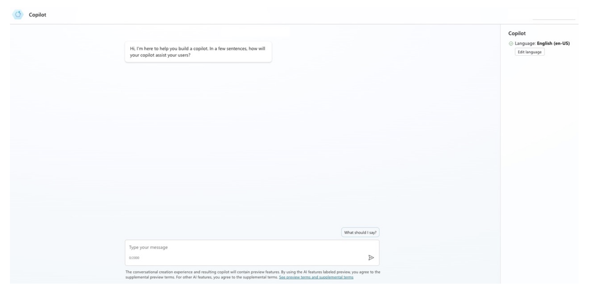
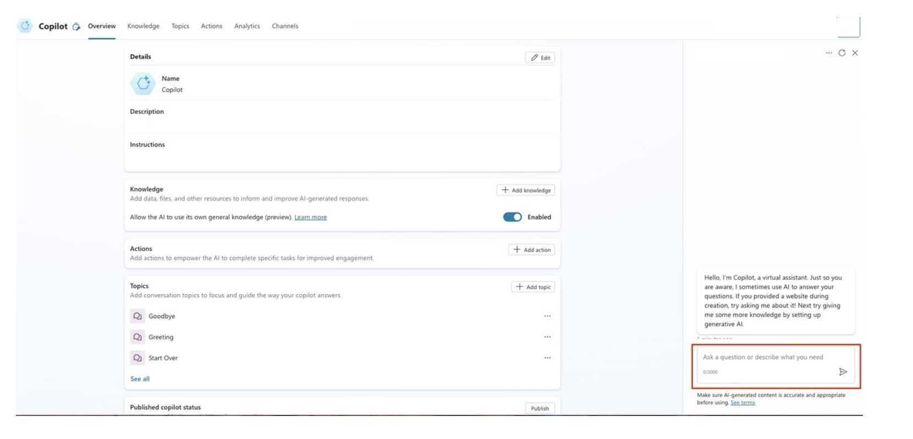
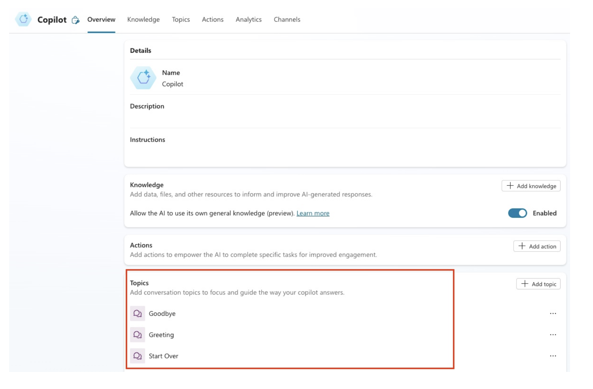

# Developing a chatbot interface

## Introduction

A chatbot interface is the primary means users interact with a chatbot system. It needs to be intuitive and user-friendly and capable of handling both natural language inputs and predefined queries. 

By the end of this reading, you will be able to:

- Identify the essential components of a chatbot interface, such as user input fields, response areas, and quick replies.
- Apply best practices for designing user-friendly, intuitive chatbot interfaces that handle natural language and predefined queries.
- Understand the role of natural language processing (NLP), dialog management, and API integrations in developing a robust chatbot interface.
- Recognize the importance of personalization, real-time interaction, and security considerations in creating effective chatbot systems.

## Key components of a chatbot interface

Explore the following key components:

- User input field 
- Response area 
- Predefined options (quick replies)
- Error handling messages 
- Typing indicator
- Feedback mechanism

### 1. User input field 

The user input field is where users type their messages or queries. This component should be designed to accept natural language input and provide easy access for users to enter their queries or commands.

**Best practices**: ensure the input field is clearly visible and accessible. If applicable, it should be able to handle both text and voice input.

### 2. Response area 

The response area is where the chatbot displays its responses to the user's queries. This section should be well-structured and capable of handling text, links, images, or other multimedia elements.

**Best practices**: keep the response area clean and easy to read. Use visual cues like spacing, fonts, and colors to distinguish between user input and chatbot responses.

### 3. Predefined options (quick replies) 

Many chatbot interfaces include predefined buttons or quick replies that allow users to select from a list of common questions or actions. This is useful for users who prefer clicking options rather than typing full queries.

**Best practices**: predefined options should be contextually relevant, concise, and always available for easy navigation. These can help users to discover the chatbot's capabilities faster.

### 4. Error handling messages 

Chatbots need to be able to handle unrecognized input or unexpected errors gracefully. Clear error messages should guide users to rephrase their query or use different inputs.

**Best practices**: avoid generic error messages like "I don't understand." Instead, provide constructive feedback such as "I'm not sure about that. Could you try asking differently?"

### 5. Typing indicator 

A typing indicator shows that the chatbot is processing the user's input and is about to respond. This feature enhances the user experience by assuring them that the chatbot is working on their query.

**Best practices**: include short, well-timed typing indicators to simulate a natural conversation and reduce the user's frustration while waiting for a response.

### 6. Feedback mechanism 

A chatbot interface should include a feedback mechanism that allows users to rate the interaction or provide input on the chatbot's performance. This helps to continuously improve the system.

**Best practices**: to collect valuable user insights, use a simple feedback option, such as thumbs up/down or star ratings, at the end of each conversation.

## Design principles for chatbot interfaces

Explore the following design principles:

- Simplicity and clarity 
- Consistent tone and language
- User-centric design

### 1. Simplicity and clarity 

The interface should be simple and intuitive. Users should be able to handle the options and design elements. Keeping the interface clean ensures that users focus on their interaction with the chatbot rather than figure out how to navigate the system.

**Example**: a customer support chatbot should present a minimalistic interface with a clear input field and concise responses, focusing on problem-solving without distractions.

### 2. Consistent tone and language 

The chatbot's tone and language should match the brand's voice and be consistent throughout the conversation. For example, a chatbot for a bank would use formal and professional language, while a chatbot for a retail brand may be more conversational and casual.

**Example**: a tech company's chatbot might use a professional tone like, "How can I assist you today?" whereas a retail chatbot might say, "What can I help you find today?"

### 3. User-centric design 

The chatbot interface must be designed with the end user in mind. Consider factors such as ease of use, accessibility for users with disabilities, and support for multiple languages or dialects. For example, a multilingual chatbot that supports text-to-speech for visually impaired users enhances accessibility and expands the chatbot's user base.

**Real-time interaction**: Users expect chatbots to respond quickly and accurately. Real-time feedback ensures that users feel engaged throughout the conversation.

**Example**: a chatbot for online shopping should provide real-time product suggestions and updates based on user queries, ensuring a seamless shopping experience.

**Personalization**: A well-designed chatbot interface should incorporate personalization features, remembering user preferences and past interactions to provide more relevant and personalized responses.

**Example**: a travel booking chatbot could remember a user's preferred destinations or travel dates, making future interactions smoother and faster.

## Techniques for developing a chatbot interface

Explore the following techniques:

- Natural language processing
- Dialog management 
- Multimodal inputs and outputs 
- APIs and integrations
- Security and privacy

### Natural language processing

NLP is the backbone of any chatbot interface. It allows the system to understand and interpret user queries written in natural language. Implementing robust NLP techniques enables the chatbot to handle complex language inputs and respond accurately.

**Example**: a healthcare chatbot may use NLP to understand how users describe symptoms and provide relevant health advice.

### Dialog management 

A chatbot needs a well-structured dialog management system to handle multiple conversation flows, track context, and ensure smooth transitions between different topics or tasks. Dialog management ensures that the chatbot understands user intent, maintains context across interactions, and selects appropriate responses at each step of the conversation.

**Example**: a customer service chatbot designed to handle requests like order status, technical support, or billing inquiries requires effective dialog management to navigate between these topics smoothly. This is achieved by implementing several key components:

- **Intent recognition**: the chatbot must first identify what the user is asking for. If a customer inquires, "What's the status of my order?" the chatbot recognizes that the user's intent is related to order status.
- **Context tracking**: once the intent is identified, the chatbot tracks the context of the conversation. For example, if the user later asks, "Can you also help me with a billing issue?" the chatbot maintains the context of the previous conversation (order status) while switching seamlessly to the new topic (billing).
- **State management**: the chatbot's dialog manager stores the state of the conversation, ensuring that if the user switches topics or asks follow-up questions, it can return to the previous task without losing track. For instance, if the user returns to ask, "What's my order number again?" after discussing billing, the chatbot can retrieve the previously provided order details.
- **Flow control**: dialog management implements structured flows that guide the conversation based on user inputs. In this example, the chatbot might first confirm the order details, then proceed to ask follow-up questions to assist with technical support or billing, without disrupting the overall experience.

By implementing such a dialog management system, the chatbot ensures coherent interactions, allowing users to navigate through different topics while keeping track of the conversation's context and flow.

### Multimodal inputs and outputs 

Chatbots may need to handle more than just text input depending on the use case. Incorporating multimodal inputs such as voice commands and visual elements (e.g., product images or instructional videos) can enhance the user experience.

**Example**: a smart home chatbot could take voice commands to control lights and visually display the statuses of home appliances on a screen.

### APIs and integrations

Chatbots are often integrated with external systems via APIs to retrieve data, process transactions, or provide dynamic responses. By leveraging APIs, chatbots can pull information from various databases or services, making them more versatile and capable of delivering real-time, personalized interactions. Building strong API connections ensures that the chatbot can seamlessly interact with different platforms and services, enhancing its functionality.

**Example**: a healthcare chatbot can use NLP to understand how users describe symptoms and provide relevant health advice, but it achieves this by integrating with several external systems through APIs. For instance:

- **Electronic health records (EHR)**: the chatbot can access a patient's medical history by connecting to an EHR system via an API. When a user reports symptoms, the chatbot retrieves past medical data, such as information about allergies or chronic conditions, to offer more accurate and personalized health advice. 
- **Symptom checker APIs**: the chatbot can query external symptom databases through an API to cross-reference the user's symptoms with known medical conditions. For example, if a user reports "chest pain and shortness of breath," the chatbot communicates with a symptom checker API to suggest possible causes, such as anxiety or cardiac issues, and recommends the appropriate next steps.
- **Appointment scheduling systems**: after analyzing the user's symptoms, the chatbot might determine that the user needs to see a healthcare professional. By integrating with the clinic's appointment system via an API, the chatbot can offer available time slots and book an appointment directly for the user.
- **Pharmacy APIs**: if the chatbot suggests over-the-counter medication based on the symptoms, it can also interact with pharmacy systems to check the availability of medications and provide pricing or pickup options through API integrations.

Through these API connections and integrations, the healthcare chatbot can retrieve patient-specific data, cross-check symptoms, schedule appointments, and assist in medication management, making it a powerful tool for providing personalized and accurate health advice. However, it is important to be aware of external governance, such as HIPAA in the US, when implementing chatbots in these scenarios.

### Security and privacy 

As chatbots handle sensitive user data, especially in industries such as finance or healthcare, it's essential to implement strong security protocols, including encryption and data anonymization, to protect user privacy.

**Example**: a healthcare chatbot must ensure that any health-related data shared in the conversation is encrypted and protected in compliance with government regulations such as HIPAA.

## Conclusion

Developing an effective chatbot interface involves combining user-friendly design with sophisticated backend technologies such as NLP, dialog management, and APIs. By focusing on key components such as user input fields, quick replies, error handling and adhering to principles of simplicity, real-time interaction, and personalization, you can create a chatbot interface that offers an engaging and seamless user experience. As chatbot technology evolves, integrating voice interfaces, multimodal outputs, and personalized user experiences will become even more important in building successful chatbot systems.
