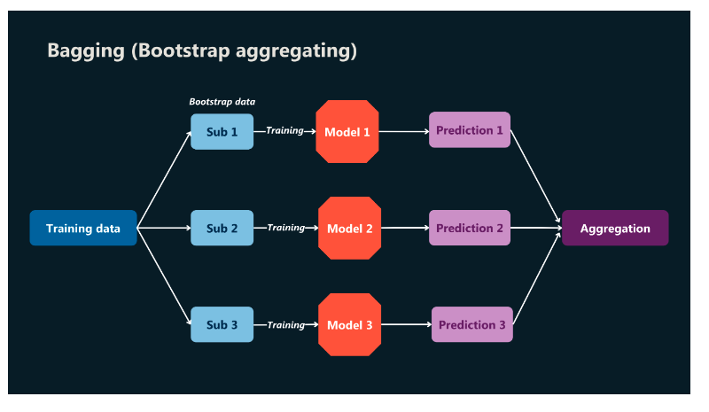
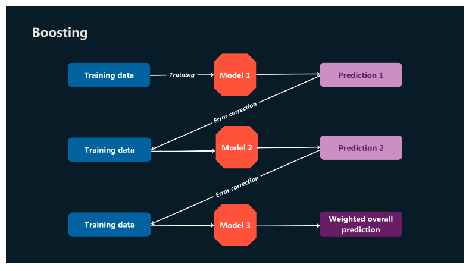
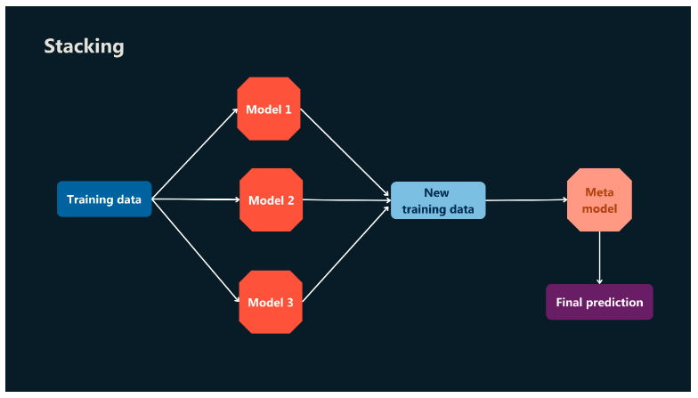

# Mastering ensemble methods: A comprehensive guide to bagging, boosting, and stacking

## Introduction
What if you could amplify the power of your machine learning models by combining their strengths while mitigating their weaknesses? Ensemble methods offer exactly this—an approach where collaboration between models produces superior results.

Ensemble methods are a cornerstone of modern machine learning, enabling developers to harness the collective power of multiple models to improve predictive performance. By strategically combining the strengths of various algorithms, ensemble methods enhance accuracy, reduce overfitting, and provide robust solutions to complex problems. In this reading, we delve deeper into ensemble methods, examining their detailed implementation and practical applications.

By the end of this reading, you will be able to:

- Explain the principles behind ensemble methods and why they outperform single models.
- Implement key ensemble techniques such as bagging, boosting, and stacking.
- Identify practical applications of ensemble methods across industries.
- Explore methods to address challenges such as interpretability and computational costs in ensemble modeling.
- Compare ensemble methods with traditional machine learning approaches to determine the best use cases.

## Detailed instructions for key techniques
### Bagging (bootstrap aggregating)
Bagging reduces variance and improves stability by training multiple models on different subsets of data. It ensures that individual model errors do not dominate the overall predictions.

#### How it works
Bagging generates multiple versions of a dataset through bootstrapping—random sampling with replacement. Each model is trained on one of these bootstrapped datasets, and their predictions are aggregated to form the final output. For classification tasks, majority voting is used, while for regression, the average prediction is calculated.

#### Implementation
Random forest, a popular implementation of bagging, builds decision trees on bootstrapped datasets. Each split in the tree considers a random subset of features, increasing diversity among the models. This aggregation reduces overfitting as each tree compensates for the weaknesses of the others.

#### Example
In credit scoring, bagging can improve the reliability of predictions by aggregating outputs from multiple decision trees, each trained on different subsets of customer data. This approach minimizes the impact of noisy or incomplete data.

### Boosting
Boosting takes a step-by-step approach, focusing on learning from the mistakes of prior models. It builds a series of models that work together to minimize errors.

#### How it works
Boosting sequentially trains models, with each model correcting the errors of its predecessor. The final output is a weighted combination of all models. Gradient Boosting Machines (GBMs) and AdaBoost are two widely used boosting techniques:

- **AdaBoost**: gives misclassified samples higher weights in the next iteration.
- **GBMs**: use gradient descent to optimize a loss function, making adjustments to the model at each step.

#### Implementation
Boosting is particularly effective for improving weak learners, such as shallow decision trees. By assigning more weight to difficult cases, it focuses on reducing bias.

#### Example
Boosting is widely used in fraud detection, where identifying rare fraudulent transactions requires high sensitivity. By iteratively refining predictions, boosting minimizes false negatives and enhances detection accuracy.

### Stacking
Stacking combines the best aspects of multiple models through a meta-learner, creating a hierarchical structure that delivers superior performance.

#### How it works
The base models make predictions, which are used as input features for the meta-learner. The meta-learner, often a linear regression or another neural network, combines these predictions to create the final output. Unlike bagging and boosting, stacking leverages diverse models to capture complex patterns.

#### Example
In e-commerce recommendation systems, stacking can integrate collaborative filtering, content-based filtering, and neural network predictions. This hybrid approach improves personalization by capturing different aspects of user behavior.

## Practical considerations
Ensemble methods offer impressive performance improvements, but they come with trade-offs that require careful management.

- **Overfitting**: while ensemble methods generally reduce overfitting, it's important to ensure diversity among base models.
- **Computational costs**: training multiple models and aggregating their predictions require significant computational resources. Parallelizing training processes can mitigate this issue.
- **Interpretability**: ensemble methods are often harder to interpret compared to single models. Techniques such as SHAP (SHapley Additive exPlanations) or LIME (Local Interpretable Model-agnostic Explanations) can help:
    - **SHAP**: a game-theoretic approach that assigns each feature an importance value. Example: In health care applications predicting heart disease risk, SHAP can highlight influential factors such as cholesterol level or age.
    - **LIME**: creates a locally interpretable model around a specific prediction. Example: In text classification, LIME can indicate which words heavily influenced a review's classification as positive or negative.

## Feature comparison: Traditional vs. ensemble methods
Choosing between traditional and ensemble methods often depends on the complexity of the task and the desired trade-off between performance and interpretability. This comparison highlights how these approaches differ in key aspects to help you make informed decisions.

| Feature | Traditional methods | Ensemble methods |
|---------|---------------------|------------------|
| Performance | Relies on a single model; performance depends heavily on its design | Combines multiple models for improved accuracy and robustness |
| Overfitting | Prone to overfitting, especially with complex models | Reduces overfitting by aggregating predictions from diverse models |
| Interpretability | Easier to interpret but may lack robustness | Often harder to interpret; requires techniques such as SHAP or LIME |
| Computational cost | Lower computational cost; single model to train | Higher cost due to training multiple models and aggregating results |
| Applicability | Works well for straightforward or small-scale tasks | Ideal for complex tasks requiring high accuracy and stability |

## Conclusion
Ensemble methods exemplify the principle that collaboration often outperforms individual effort. By leveraging diverse models and advanced aggregation techniques, they offer a powerful toolkit for solving complex machine learning problems. Whether applied in health care, finance, or natural language processing, ensemble methods continue to set the benchmark for accuracy and robustness in predictive modeling.
